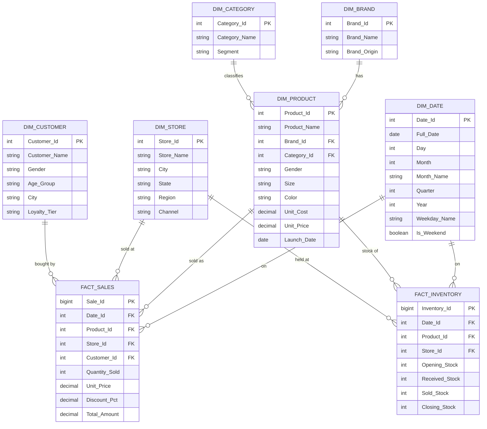

# Entity Relationship Diagram — FootwearDW

**Design**: classic star schema — two fact tables (`Fact_Sales`, `Fact_Inventory`)
surrounded by shared conformed dimensions (`Dim_Date`, `Dim_Product`, `Dim_Store`).
`Dim_Product` is itself snowflaked one level into `Dim_Brand` and `Dim_Category`
to avoid repeating brand/category attributes across 120+ product rows.
